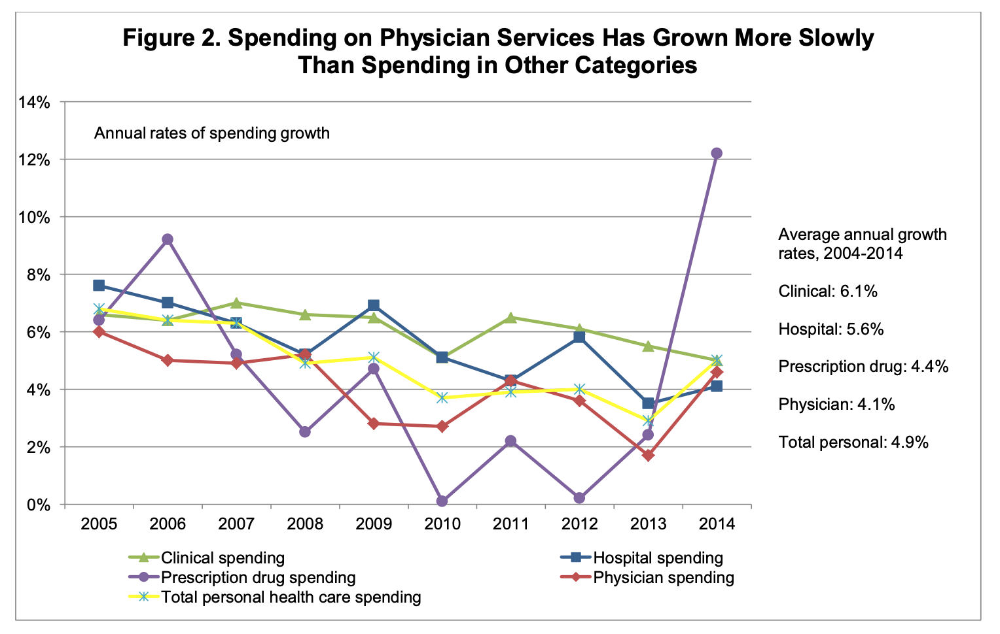
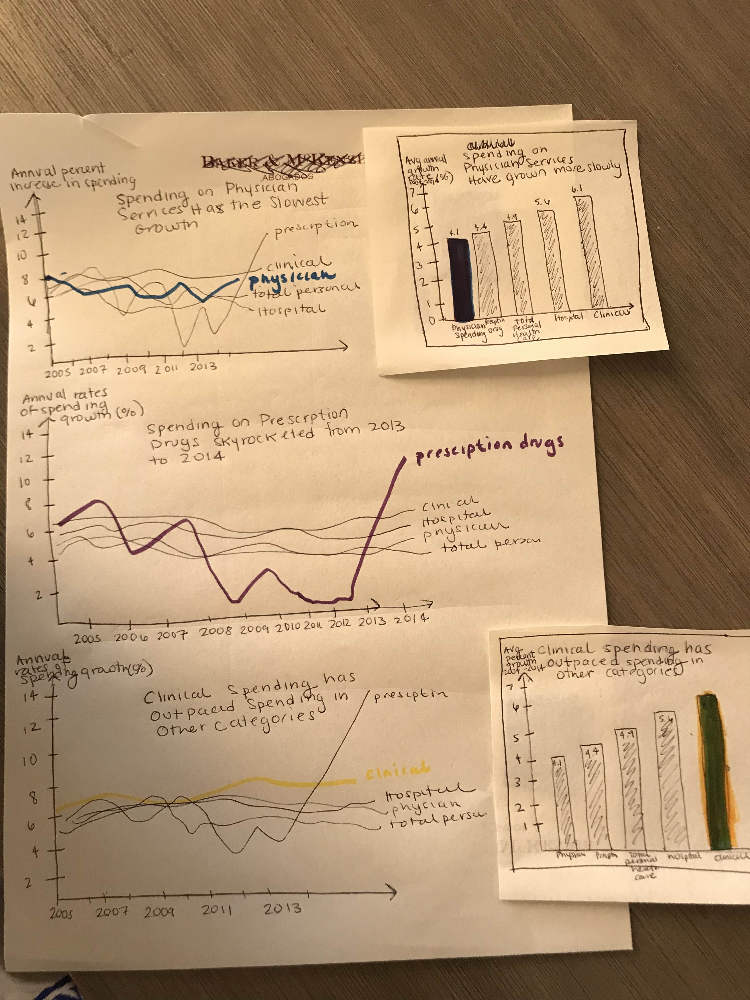

# Assignment 3 & 4: Critique By Design

## Step 1: Find a Data Visualization
I selected the visualization shown below, from the report titled “Policy Research Perspectives: National Health Expenditures, 2014: Spending Grows by More Than 5% for First Time Since 2007." 

Source: Kane, Carol K. PhD. “Policy Research Perspectives: National Health Expenditures, 2014: Spending Grows by More Than 5% for First Time Since 2007.” American Medical Association, 2016. https://www.ama-assn.org/system/files/corp/media-browser/member/health-policy/prp2016-01spending_0.pdf. 

## Step 2: Critique the Data Visualization
This visualization is from a report from the American Medical Association, reviewing U.S. health expenditures from 2004 to 2014. This figure captures both the annual rates of spending growth and the average annual growth rate from 2004 to 2014. This chart accurately represents the information presented, but does so in a clunky and un-intuitive way. A line-chart works well because the author analyzed trends over time. The y-axis scale works well, allowing the trend to be proportionally represented. The author correctly represents time moving from left to right. The title also sufficiently describes the main idea of the graph, without directly repeating what is represented in the chart. 

While the title successfully describes an accurate conclusion, the visualization does not necessarily emphasize that trend. The visualization should highlight the physician spending line to match the main idea described in the title of the chart. The symbols for each data point are also messy and unnecessary. I found the placement of the y-axis title to be distracting; moving the title directly above the y-axis would be a more logical placement. Also, the x-axis tick marks are misaligned with the year, which makes it more difficult to read the chart. Finally, the most confusing element of the visualization is the secondary information listed to the right of the chart. It took me a few minutes to understand that these numbers represent the overall average growth from 2004 to 2014. I initially thought that either this additional information should be omitted, or perhaps that a bar graph of just that information would be sufficient to represent the main idea of the visualization. Overall, I chose to redesign this figure, because I thought this chart could be improved with a few, simple changes.

## Step 3: Wireframe a Solution
In the next phase of the exercise, I wireframed three possible ways to improve the visualization. I explored different trends in the data, and whether to visualize the annual rates of spending growth and/or the average annual growth rates data. I explored both line charts and bar graphs. I also tested out phrasing for the title and the axis labels, as well as the use of color. Please see the wireframes below. 

## Step 4: Test the Solution
I then presented my wireframes to two friends and asked them the following questions. Their responses are grouped under each question.

### 1. Can you describe to me what this is telling you?
* User 1: It seems like all 3 options are trying to communicate the varying growth rates of different types of healthcare spending. They each highlight a different category of spending - physician services, clinical, and prescription drugs.
* User 2: The first one is telling me that spending on physician services has the slowest growth compared to other healthcare spending, the second tells me that spending on prescriptions has increased dramatically within a year, and the last one tells me that spending on clinical services is consistently higher than the other categories.

### 2.  Is there anything you find surprising or confusing?
* User 1: The only confusing thing is what category I’m supposed to be focusing on. Since each graph is highlighting different information, I’m having a hard time comparing them to determine which graph is “best”. I will say that if I’m just supposed to be concerned with topline numbers, then the bar graphs are MUCH more intuitive than the line charts. 
* User 2: No, I think all the graphs presented are clear and easy to understand. I think it just depends on what story you are trying to tell which graph is best. 

### 3. Who do you think is the intended audience for this?
* User 1: I imagine these graphs are for healthcare analysts or administrators, or insurance companies and legislators. 
* User 2: Insurance companies or healthcare administrators.

### 4.  Is there anything you would change or do differently?
* User 1: As I mentioned previously, it’s hard to say which graph is “doing the best job” since they’re highlighting different parts of the data. I would recommend the author determine A) what category of spending they’re trying to highlight and B) whether they need to show the granular year over year changes. If it can just be summary statistics, then I think the bar graphs are superior. 
* User 2: I would decide what is the most important story from the data you want to tell and use the graph that reflects that. If it is most important that people know that physician spending has grown slower than the other categories, I think the bar graph does that best. If it is that prescription drug prices have increased a lot, the second line graph. If it is that clinical spending has outpaced other spending, I think the line graph tells that information better than the bar chart because it's easier to see the consistent higher spending that way.

### 5.  Do you think both visualizations (line and bar graph) are necessary? Do they complement each other? 
* User 1: I err towards the “less is more” and “keep it stupid simple” philosophies, so if there’s not an explicit need for the year by year changes, then I vote for just using the bar graph. If the audience needs to see the year over year changes, then definitely keep the bar graph in addition. 
* User 2: Similar to my previous answer, I think it depends on what you are trying to get across. If the audience does not need to see the change over time, than the bar graph is easier to understand.

### User Research Reflections
The user responses confirmed that there are multiple trends in this data set, and the best way to visualize the information depends on which “story” I want to tell. Based on the title of the original visualization, I decided that highlighting lower rates of physician services spending growth was the most important story to tell in the redesigned visualization. The user research confirmed that the best way to tell this specific story would be to produce a bar chart of the average annual growth rate information, originally located on the right side of the figure. 

## Step 5: Build Your Solution
I redesigned the original chart into the visualization shown below. 

When redesigning the visualization, the most significant design decision I needed to make was deciding which story I wanted to tell. As I mentioned above, based on the title of the original visualization, I decided that highlighting lower rates of physician services spending was the right narrative to highlight in the redesigned visualization. I felt that the average annual growth rates from 2004 to 2014 better illustrated this trend, as compared to the annual rates of spending growth each year displayed in the original line chart. When I looked at the original line chart, I could not deduce this trend from the figure without reading the title.

After choosing the story that I wanted to tell, I decided that the best way to highlight this information would be to create a simple bar chart with the average annual growth rate information. I experimented with more complicated, interactive visualizations including a proportional circle chart and a multi-series bar graph with a drop down menu for each year and the average spending rate growth. Ultimately, I decided that the intended audience of medical and health policy professionals would appreciate a simple and quick summary visualization. 

Another major design decision was the titles and axis text. As someone less familiar with health policy terminology, it took me time to think through the metrics displayed in the original chart. Even though I envision the primary audience for the new visualization to be health policy folks, I wanted the title and labels to be accessible to a broader audience. To do so, I worked through several iterations of the axis-label and title text. I also asked my group during class for additional feedback on this element. After several iterations, I ended up with a title and subtitle that I feel clearly describes the visualization and highlights the important trend. I wish I could have crafted a shorter title and subtitle, but I ultimately opted for clarity over brevity. 

Other design decisions that I made included adding labels at the top of each bar. Since there were only five bars, I felt that the labels did not add visual clutter. I then removed the chart lines to reduce redundancy. I also debated about which color to use to highlight physician spending. In the original figure, red represented physician spending growth rate. At first I thought I should use red in the redesign for continuity’s sake. However, in the context of the new design the red bar evoked a negative trend, when in reality lesser physician spending rate is probably a positive trend. I decided to switch the color to blue, because I personally associate that color with physicians. If I was producing this graph for the American Medical Association, I would seek specific user feedback on color. I chose to make the other elements of the visualization grey, so that the focus of the chart was the physician spending bar. 

Overall, I felt that this was an exercise in using visualizations to tell the story that you actually want to tell. To create my final redesign I combined my observations from the critique, design elements from the wireframes, and user feedback. I ultimately picked a clean design that represented the main idea of the original chart and crafted a clear title and axis label. As a result, my redesign is clean and effective. 

[Back to TSWD Portfolio Home](/README.md)
